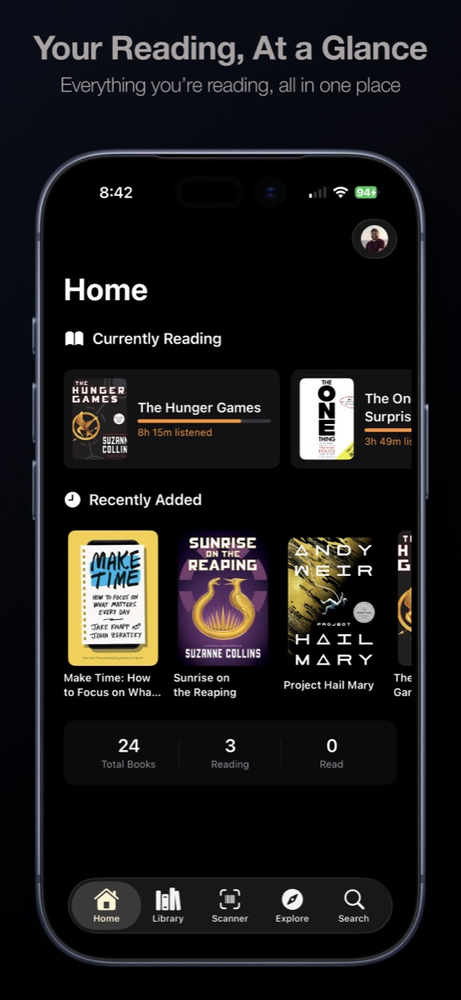
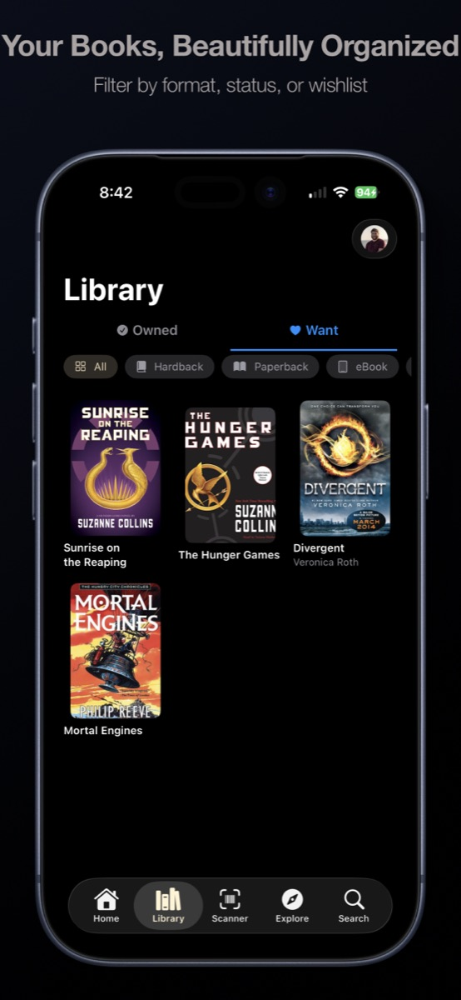
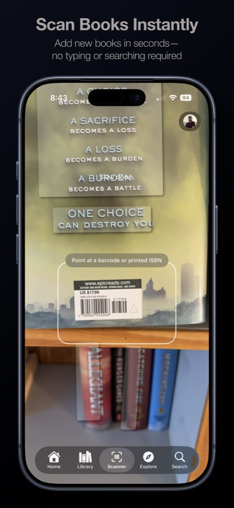
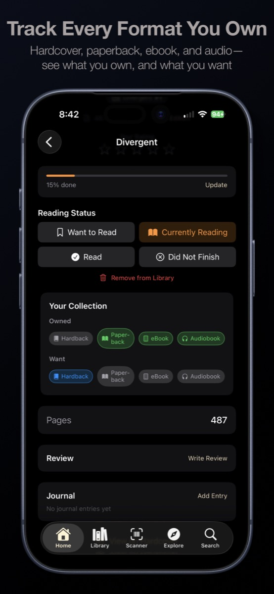
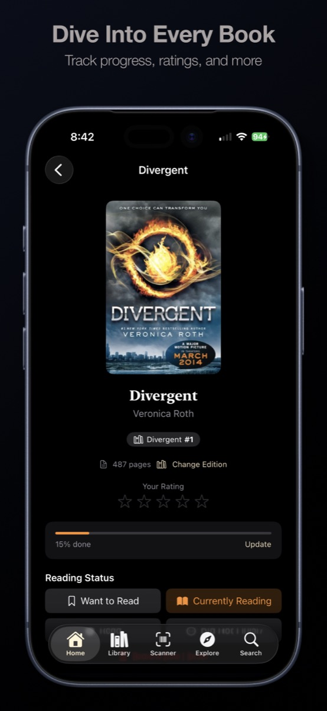

<p align="center">
  
</p>

<h1 align="center">Dustjacket</h1>

<p align="center">
  A native iPhone app for managing your <a href="https://hardcover.app">Hardcover</a> library.
</p>

<p align="center">
  Scan books, track every format you own, browse your collection offline, and keep Hardcover in sync from your pocket.
</p>

<p align="center">
  
</p>

<p align="center">
  <strong>SwiftUI</strong> · <strong>SwiftData</strong> · <strong>VisionKit</strong> · <strong>Hardcover GraphQL API</strong>
</p>

## Highlights

- Barcode scanning with OCR fallback for printed ISBNs inside the book.
- An 8-list format system for hardback, paperback, ebook, and audiobook across Owned and Want.
- Fast native browsing for your reading progress, library, search, lists, and stats.
- Offline-first caching with queued mutations that sync back to Hardcover when you reconnect.

## Screenshots

<p align="center">
  
  
  
  
</p>

## Features

### Barcode Scanner

Scan a book barcode with the camera, fall back to OCR for printed ISBNs, or use manual search when needed.

### 8-Format Collection System

Dustjacket organizes your Hardcover lists across format and ownership:

| Owned | Want |
| --- | --- |
| Hardback | Hardback |
| Paperback | Paperback |
| eBook | eBook |
| Audiobook | Audiobook |

### Library and Discovery

- `Home` for currently reading, recently added, and quick stats.
- `Library` for ownership and format filters with infinite-scroll browsing.
- `Explore` for trending books and featured lists.
- `Search` for books, authors, series, and lists.

### Profile and Account Tools

The avatar menu provides quick access to goals, lists, activity, stats, social features, settings, and token management.

### Offline Support

- SwiftData-backed local cache for books, editions, list mappings, and pending mutations.
- Sequential mutation queueing to avoid Hardcover API write conflicts.
- Visible sync state when pending writes still need to be pushed.

## Requirements

- iOS 17.0+
- Xcode 15+
- A [Hardcover](https://hardcover.app) account with an API token

## Getting Started

1. Clone the repository.

   ```bash
   git clone https://github.com/pcamp96/dustjacket.git
   cd dustjacket
   ```

2. Open the project in Xcode.

   ```bash
   open Dustjacket.xcodeproj
   ```

3. Set your signing team in **Signing & Capabilities**.
4. Build and run on a device or simulator.
5. Get your Hardcover API token from **Account Settings** → **Hardcover API** on `hardcover.app`.
6. Paste the token into Dustjacket's login screen.

On first launch, Dustjacket validates the token, runs the list setup wizard, and creates or matches your 8 Dustjacket lists.

## Development

`project.yml` is the source of truth for project settings. Regenerate the Xcode project after changing it:

```bash
xcodegen generate
```

Useful local validation commands:

```bash
xcodebuild -project Dustjacket.xcodeproj -scheme Dustjacket -configuration Debug build
xcodebuild -project Dustjacket.xcodeproj -scheme Dustjacket -destination 'platform=iOS Simulator,name=iPhone 17' build
```

Camera and barcode scanning flows should also be checked on a physical device.

## Architecture

| Layer | Description |
| --- | --- |
| `Services` | `GraphQLClient` (raw `URLSession` + `Codable`, rate-limited at 55 req/min), `HardcoverService`, `KeychainManager`, and ISBN lookup |
| `Managers` | Shared `@MainActor` state such as `LibraryManager`, `ScannerManager`, `SyncManager`, and `MutationQueue` |
| `Models` | Domain structs like `Book`, `Edition`, `DJList`, and format types decoupled from API response models |
| `Persistence` | SwiftData models for the offline cache, list mappings, and queued mutations |
| `Views` | SwiftUI feature views and reusable components, with UIKit only where platform APIs require it |
| `Theme` | Shared palette and glass styling helpers |

### Key Design Decisions

- No Apollo: raw `URLSession` + `Codable` keeps the networking layer small and aligned with the rest of the app.
- Optimistic UI: books appear immediately while writes finish in the background.
- Sequential mutations: Hardcover rejects overlapping list writes, so `MutationQueue` serializes them with delays.
- Protocol-based services: `HardcoverServiceProtocol` keeps the app mockable and isolates API churn.

## Project Structure

```text
Dustjacket/
├── App/            Entry point and root navigation
├── Models/         Domain models
├── Services/       Hardcover API, keychain, ISBN lookup
├── Managers/       Shared app state
├── Views/          SwiftUI feature views
├── Views/Components/
├── Wizard/         First-run list setup flow
├── Persistence/    SwiftData cache models
└── Theme/          Reusable styling
```

## Tech Stack

- UI: SwiftUI
- Networking: `URLSession` + GraphQL
- Persistence: SwiftData
- Scanning: VisionKit and Vision OCR
- Auth: iOS Keychain
- Project generation: [XcodeGen](https://github.com/yonaskolb/XcodeGen)

## License

This project is licensed under the MIT License. See [LICENSE](LICENSE).
